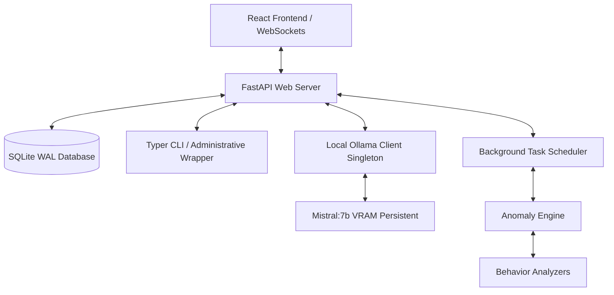

# SentinelAI Architecture Guide

SentinelAI is a production-grade, local, privacy-first system monitoring and behavioral anomaly detection platform. This document explains the core modules, data flows, and design choices.

---

## 1. System Topology Overview

## 2. Core Components

### A. FastAPI Web Server & Router Layer
Located in `backend/routers/` and bootstraped via `backend/main.py`.
- Exposes REST endpoints for system alerts, health reports, baseline statistics, and LLM chat.
- Uses a **WebSocket Connection Manager** to stream live telemetry (CPU, RAM, active processes, system logs) directly to the browser dashboard every 2 seconds.
- Uses FastAPI **Lifespan Context Manager** to coordinate database migrations, start background telemetry collection, and schedule periodic analytical checks on startup.

### B. Persistent local LLM Integration (`backend/services/ollama_client.py`)
- **Connection Pooling**: Uses a singleton HTTP client wrapper over the `ollama` SDK to reuse the underlying TCP socket pool, preventing handshake overhead.
- **VRAM Model Keep-Alive**: Passes `keep_alive="-1"` (or custom `"24h"`) on initial load to ensure the `mistral:7b` model resides permanently in GPU/system memory, eliminating the cold-start delay.
- **Asynchronous Execution Thread Pool**: Allocates a separate `ThreadPoolExecutor` dedicated solely to heavy LLM inferences. This ensures FastAPI's main event loop remains responsive (preventing UI disconnects/offline alerts during generation).
- **Concurrency Caps**: Uses an `asyncio.Semaphore` to queue excess chat queries gracefully instead of spawning unlimited CPU/GPU-thrashing threads.

### C. Universal Time-Aware RAG Pipeline (`backend/services/rag_service.py`)
- **Intent Classifier**: Parses natural language requests against regex and priority keyword lists to identify specific targets (e.g. `RAM_SPIKE`, `CPU_QUERY`, `INCIDENT_QUERY`).
- **Dynamic Time Filtering**: Uses `extract_time_window()` to compute start/end datetime boundaries from phrases like "yesterday", "last night", or "today".
- **SQL Context Bounds**: Feeds the time window directly to SQLAlchemy database filters, restricting fetched data to a maximum of 10 rows. This limits the prompt length to ~1500 characters, safeguarding fast inference times (< 5-10s) and avoiding timeouts.

### D. Behavioral Anomaly Detection & Baseline Engine
- **Baseline Engine (`backend/services/baseline_engine.py`)**: Gathers historical `HealthLog` samples (min. 15 required) to compute typical behavior margins: mean, standard deviation, and p95 thresholds for CPU/RAM/Disk, as well as a known process registry.
- **Anomaly Engine (`backend/services/anomaly_engine.py`)**: Runs every 5 minutes. Distributes resource snapshots to specialized behavior analyzers:
  - `resource_analyzer.py`: Checks for CPU/RAM outliers using mean + margin formulas.
  - `process_analyzer.py`: Identifies resource-heavy unknown processes.
  - `drift_analyzer.py`: Tracks behavior drift.
  - `startup_analyzer.py` & `time_analyzer.py`: Monitors startup integrity.
- **Incident Engine (`backend/services/incident_engine.py`)**: Creates system incidents and alerts when anomalies are found.

### E. SQLite WAL Engine
- The database is configured with **Write-Ahead Logging (WAL)**. This unlocks concurrent reads while writing telemetry, preventing SQLITE_BUSY locking errors during intensive monitoring.

### F. Multi-Log Rotation
- Log files are divided into categories: `application.log`, `backend.log`, `llm.log`, `behavior.log`, `database.log`, and `startup.log`. Sinks are automatically managed and rotated at 10MB sizes.
